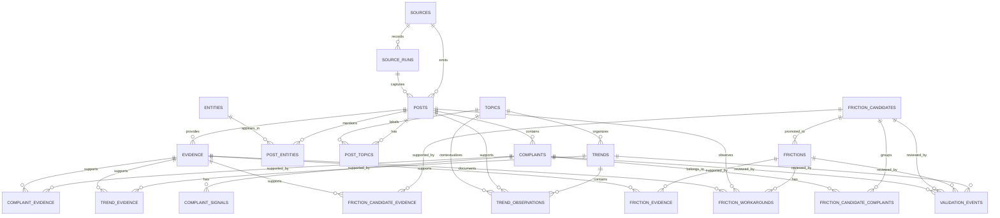

# Entity Relationship Diagram

## Evidence-First Relationship Diagram



## Relationship Notes

- `posts` are the canonical normalized observation unit.
- `evidence` records traceable excerpts, links, notes, or source artifacts.
- `trends` are supported by repeated observations and linked evidence.
- `complaints` are atomic problem observations connected to posts and evidence.
- `friction_candidates` group complaints before human validation.
- `frictions` represent human-validated persistent friction patterns.
- `validation_events` preserve human decisions as event history instead of storing confidence scores.

## Dependency Direction

Database access should remain behind repositories:

```text
modules / reports
        ↓
repositories
        ↓
core storage
        ↓
SQLite
```

Engines and reports should not execute raw SQL or manage SQLite connections directly.
